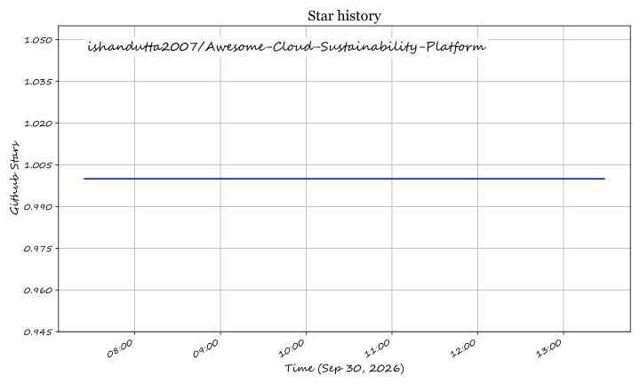

# Awesome Cloud Sustainability Platform 🌿

  
  
  
  
  

## 📌 Top Cloud Sustainability & Carbon Accounting Platforms Ecosystem 🌍

**Curated List of Enterprise SaaS Products & Open-Source GitHub Projects**  
*Focused on Carbon Accounting 📊, GHG Protocol Reporting 📜, CSRD Compliance 🇪🇺 & ESG Data Management 🌿*  

---

### 💡 Overview & SEO Summary

Welcome to the **Awesome Cloud Sustainability Platform** index! As enterprise sustainability regulations tighten across North America and Europe (such as the EU's CSRD, SEC Climate Disclosures, and California SB 253/261), organizations require robust **Cloud Sustainability Platforms**, **Carbon Footprint Accounting Software**, and **GreenOps / Energy Management Systems**. 

This curated directory captures leading enterprise **Software-as-a-Service (SaaS)** climate platforms alongside production-ready **Open-Source** carbon accounting libraries and calculators. Whether calculating Scope 1, Scope 2, or Scope 3 supply chain footprint emissions, tracking IT cloud compute carbon intensity, or preparing audit-ready CSRD compliance reports, this repository provides complete transparency into existing software options.

---

## 📑 Table of Contents
- [🏢 Market Overview & Size](#-market-overview--size)
- [💼 SaaS / Enterprise Hosted Platforms](#-saas--enterprise-hosted-platforms)
- [🔓 Open-Source GitHub Projects](#-open-source-github-projects)
- [🤝 How to Contribute](#-how-to-contribute)
- [☕ Support & Community](#-support--community)
- [⚠️ Disclaimer](#%EF%B8%8F-disclaimer)
- [📈 Star History](#-star-history)

---

## 🏢 Market Overview & Size

> 📈 **Market Size & Structure**: The global Enterprise Sustainability Management & Carbon Accounting Software market is estimated at **~$15.8 Billion (2026)** and is projected to expand at a CAGR of **~22.4%** through 2032. 
> 
> 🧩 **Market Fragmentation**: The sector is **moderately to highly fragmented**. While major legacy tech conglomerates (IBM, Microsoft, Salesforce) have acquired or built dedicated suites, no single provider owns a dominant share ("winner-take-all"). The market remains split between high-growth venture-backed pure-plays (Watershed, Sweep, Persefoni) and domain-specific open-source calculation engines.

---

## 💼 SaaS / Enterprise Hosted Platforms

Below is a breakdown of top commercial cloud sustainability platforms, sorted by **Company Size / Valuation / Revenue** in descending order.

| Platform 🚀 | Market Size / Valuation / Revenue 🏢 | Pricing (Starting Tier) 💵 | Free Tier Limit / Trial Offer 🎁 | Key Features & Core Focus 🎯 |
| :--- | :--- | :--- | :--- | :--- |
| **[Microsoft Cloud for Sustainability](https://www.microsoft.com/en-us/sustainability/cloud)** | **$3.1 Trillion** *(Market Cap)* | **$4,000 / tenant / month** *(Sustainability Manager)* | 30-day Free Trial (Full feature access for 1 tenant environment) | Enterprise ESG platform built on Dynamics 365 & Power Platform. Standardized data models & real-time emissions tracking across Scopes 1–3. |
| **[Salesforce Net Zero Cloud](https://www.salesforce.com/)** | **$310 Billion** *(Market Cap)* | **$48,000 / organization / year** *(Starter Edition)* | 30-day Free Trial (Pre-configured trial org with sample ESG data) | Integrated carbon accounting & ESG reporting on Salesforce CRM. Automated emissions tracking & supplier engagement. |
| **[IBM Envizi](https://www.ibm.com/products/envizi)** | **$210 Billion** *(Market Cap)* | **$18,000 / year** *(Base ESG Data Foundation)* | 14-day Guided Sandbox Trial (Access to sample tenant & calculation engine) | Enterprise ESG data management & carbon accounting suite with 15+ years of market history. ISO 50001 & GHG Protocol aligned API. |
| **[Watershed](https://watershed.com/)** | **$1.8 Billion** *(Valuation)* | **$25,000 / year** *(Standard Tier)* | No permanent free tier; 14-day custom sandbox trial upon request | Climate-first enterprise platform managing ~3 gigatonnes CO₂e. Features AI-assisted disclosure drafting & CDP API submission. |
| **[Persefoni](https://www.persefoni.com/)** | **$1.0 Billion** *(Valuation)* | **$10,000 / year** *(Pro Edition)* | **Persefoni Essentials (Free Forever)**: 1 user seat, Scope 1 & 2 operational footprint calculation | Climate management platform with strong PCAF-aligned financed emissions calculation for financial institutions & enterprises. |
| **[Sweep](https://www.sweep.net/)** | **$300 Million** *(Valuation)* | **$15,000 / year** *(Growth Tier)* | 14-day Free Sandbox Trial (Includes Scope 1 & 2 reporting demo) | Sustainability intelligence platform with "report once, file everywhere" mapping (CSRD, ISSB, GRI, CDP, SASB, TCFD, SB 253). |
| **[Greenly](https://greenly.earth/)** | **$150 Million** *(Valuation)* | **$1,950 / year** *(SMB Base Tier)* | 7-day Free Trial (Full SMB Carbon Footprint assessment demo) | User-friendly carbon accounting & Product Lifecycle Assessment (LCA) tools targeted at SMBs and mid-market organizations. |
| **[Normative](https://normative.io/)** | **$100 Million** *(Valuation)* | **$12,000 / year** *(Enterprise Starter)* | **Business Carbon Calculator (Free Forever)**: Unlimited Scope 1 & 2 carbon calculation for SMEs | Integrated carbon accounting platform with specialized automated modules for Scope 3 supply chain & product carbon footprint (PCF). |
| **[Plan A](https://plana.earth/)** | **$80 Million** *(Valuation)* | **$7,500 / year** *(Starter Plan)* | 14-day Free Trial (CSRD Readiness Assessment Tool access) | EU decarbonization-first carbon accounting software with localized regulatory compliance mapping for CSRD & ISSB. |
| **[SINAI Technologies](https://www.sinaitechnologies.com/)** | **$45 Million** *(Valuation)* | **$14,000 / year** *(Base Platform)* | 14-day Custom Demo Sandbox | Decarbonization platform built for industrial & enterprise operations. Dynamic marginal abatement cost curves (MACC) & scenario analysis. |

---

## 🔓 Open-Source GitHub Projects

Open-source carbon accounting engines and energy platforms allow organizations to build audit-proof, sovereign sustainability data infrastructure. Below are top repositories sorted by **GitHub Stars_Count** (descending) 🌟.

| Project 📦 | GitHub_Stars ⭐ | Primary Domain 🏷️ | Core Description & Capabilities ⚡ |
| :--- | :--- | :--- | :--- |
| **[Cloud Carbon Footprint](https://github.com/cloud-carbon-footprint/cloud-carbon-footprint)** |  | **Cloud & GreenOps Footprint** | Premier open-source tool for measuring and visualizing cloud carbon emissions & energy consumption across AWS, GCP, and Azure. |
| **[MyEMS](https://github.com/MyEMS/myems)** |  | **Energy Management & Carbon** | Industry-leading open-source Energy Management System (ISO 50001 aligned). Collects, analyzes, and reports energy/carbon for electricity, gas, & water. |
| **[OpenClimate Data](https://github.com/openclimate/openclimate)** |  | **Open Climate Data & Accounting** | Open-source platform aggregating global climate accounting data, emissions inventories, and climate action commitments. |
| **[GreenOps Platform](https://github.com/cherryaugusta/greenops-carbon-accounting-platform)** |  | **Full-Stack ESG Reporting** | Django 5.2 + React full-stack ESG carbon accounting platform with audit trails, employee travel logging, and drag-and-drop report builder. |
| **[OpenGHG](https://github.com/mindsongreen/OpenGHG)** |  | **Auditable Carbon Calculator** | Transparent, formula-explicit carbon footprint calculator with federated database architecture and zero black-box calculations. |
| **[ESG Reporting AI](https://github.com/shashank-dj/esg-reporting-ai)** |  | **AI-Augmented CSRD Reporting** | Streamlit + GPT-4o-mini platform for Scope 1-3 calculation, ESG audit readiness scoring (0-100), and ESRS E1 CSRD gap analysis. |
| **[Re-Emission](https://github.com/Re-Emission/Re-Emission)** |  | **Product LCA & Reservoirs** | Peer-reviewed Python library (GNU GPL v3.0) for estimating, visualizing, and reporting reservoir GHG emissions using G-res framework. |
| **[ESG Cradle to Gate](https://github.com/open-lca/esg-cradle-to-gate)** |  | **SME LCA & Product Footprint** | Digital cradle-to-gate LCA tool based on ISO 14040/14044 containing 5,000+ emission factors for SME product carbon footprints. |

---

## 🛠️ Recommended Stack for Building Enterprise ESG Platforms

To build a sovereign internal enterprise ESG reporting engine, combine these open-source building blocks:
- 🔌 **Data Collection & IoT**: [MyEMS](https://github.com/MyEMS/myems) for facility energy, HVAC, and smart meter ingestion.
- ☁️ **Cloud Infrastructure Carbon**: [Cloud Carbon Footprint](https://github.com/cloud-carbon-footprint/cloud-carbon-footprint) for multi-cloud (AWS/GCP/Azure) compute emissions.
- 📐 **Calculation Engine**: [OpenGHG](https://github.com/mindsongreen/OpenGHG) for transparent unit algebra & audit-proof GHG Protocol formulas.
- 📋 **Reporting & Workflows**: [GreenOps](https://github.com/cherryaugusta/greenops-carbon-accounting-platform) or [ESG Reporting AI](https://github.com/shashank-dj/esg-reporting-ai) for CSRD gap analysis, manager sign-offs, and report generation.

---

## 🤝 How to Contribute

Contributions are welcome! Please follow these simple guidelines:

1. Fork this repository 🍴.
2. Add/update entries in `README.md` keeping formatting consistent.
3. Ensure links are active and descriptions remain factual and objective.
4. Submit a Pull Request (PR) with a clear title and description 🚀.

Check out [Awesome-Awesome-Awesome](https://github.com/ishandutta2007/Awesome-Awesome-Awesome) for more curated lists!

---

## ☕ Support & Community

If you find this repository helpful for your sustainability research, ESG engineering, or corporate decarbonization journey, please consider supporting the project:

- 🌟 **Star this repository** to increase visibility!
- 🔀 **Fork & Share** with your team or sustainability community.
- ☕ **Buy me a coffee**: Support ongoing open-source research via the [GitHub Sponsors Dashboard](https://github.com/sponsors/ishandutta2007).

Thank you for helping make cloud software more sustainable, transparent, and auditable! 💙

---

## ⚠️ Disclaimer

- This is a community-curated directory for research and educational purposes — not an explicit commercial endorsement.
- Enterprise emissions reporting requires compliance with official frameworks (GHG Protocol Corporate Standard, ISO 14064, EU CSRD ESRS E1, SEC Climate Rules). Always verify data accuracy with accredited environmental auditors.

---

## 📈 Star History

## ⭐ Star History

<a href="https://star-history.com/#ishandutta2007/Awesome-Cloud-Sustainability-Platform&Timeline" align="center">
  <picture>
    <source media="(prefers-color-scheme: dark)" srcset="assets/ishandutta2007_Awesome-Cloud-Sustainability-Platform_growth.svg">
    
  </picture>
</a>
